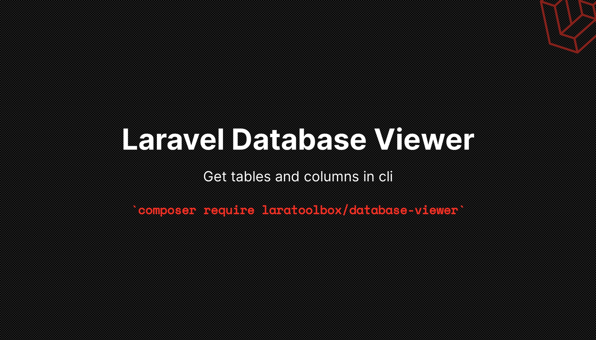

[](https://packagist.org/packages/laratoolbox/database-viewer)
[](https://travis-ci.org/laratoolbox/database-viewer)
[](https://scrutinizer-ci.com/g/laratoolbox/database-viewer)
[](https://packagist.org/packages/laratoolbox/database-viewer)

This package adds commands for getting table / column info into artisan cli.

## Installation

You can install the package via composer:

```bash
$ composer require laratoolbox/database-viewer
```

## Usage

* Get tables
```shell
$ php artisan db:tables

failed_jobs
migrations
password_resets
users
```

* Get columns for a specific table
```shell
$ php artisan db:columns --table=users

id
name
email
email_verified_at
password
remember_token
created_at
updated_at
```

* Get columns for a specific table as doc block formatted
```shell
$ php artisan db:columns-doc --table=users

/**
 * @property int $id
 * @property string $name
 * @property string $email
 * @property string|\Illuminate\Support\Carbon $email_verified_at
 * @property string $password
 * @property string $remember_token
 * @property string|\Illuminate\Support\Carbon $created_at
 * @property string|\Illuminate\Support\Carbon $updated_at
 */
```

### Testing

``` bash
$ composer test
```

### Changelog

Please see [CHANGELOG](CHANGELOG.md) for more information what has changed recently.

## Contributing

Please see [CONTRIBUTING](CONTRIBUTING.md) for details.

### Security

If you discover any security related issues, please email hasansemiherdogan@gmail.com instead of using the issue tracker.

## Credits

- [Semih ERDOGAN](https://github.com/laratoolbox)
- [All Contributors](../../contributors)
- The social image generated with [banners.beyondco.de](https://banners.beyondco.de/).
- This package was generated using the [Laravel Package Boilerplate](https://laravelpackageboilerplate.com).

## License

The MIT License (MIT). Please see [License File](LICENSE.md) for more information.
